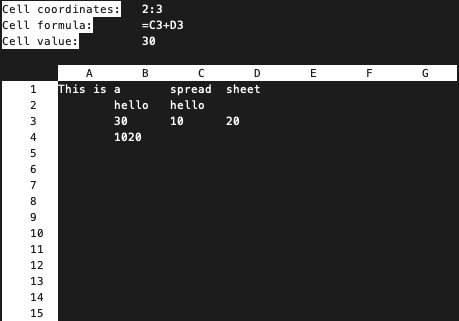

# Simple spreadsheet

This is an implementation of a simple spreadsheet based on Excel, written in C++.

### Requirements
You need to have ncurses installed. On a classic linux distribution, just do:
> ```yum install ncurses-devel```

### Makefile commands

To run this project, first clone this repository:
> ```git clone git@github.com:vumilan/simple_spreadsheet.git```

Go into the project repo:
> ```cd simple_spreadsheet```

Make compilation files:
> ```make compile```

And run the project:
> ```make run```

### Project 
Upon running the project, you will be greeted with:
```
Simple spreadsheet v1.0 by Milan Vu
Press the key 'c' to create a new sheet.
Press the key 'l' to load a sheet.
Press the key 'x' to exit.
```
Pressing ```c``` will create a new spreadsheet, while pressing ```l``` will load a spreadsheet from a ```.csv``` file saved in ```/examples```.

After choosing one of two options above, you will be greeted with the spreadsheet editor:



Functionality:
- Use arrow keys to move between cells.
- To edit a cell, press ```enter``` while on that specific cell.
- To enter a formula, put ```=``` in the cell first.
- Example of a cell formula: ```= A1 + A2 + CONCAT(A3, A4)```
- Save the spreadsheet into ```/examples``` by pressing ```s``` in the editor.

Right of this moment, the spreadsheet editor supports:
- numbers and strings in cells
- 4 functions: SIN, ABS, COS, CONCAT
- basic operators: +, -, *, /
- everything above can be used with literals and cells

### Documentation

This project also has a Doxyfile, if you wish to view the documentation:
> ```make doc```

Finally, to clean the repository from the created files:
> ```make clean```
